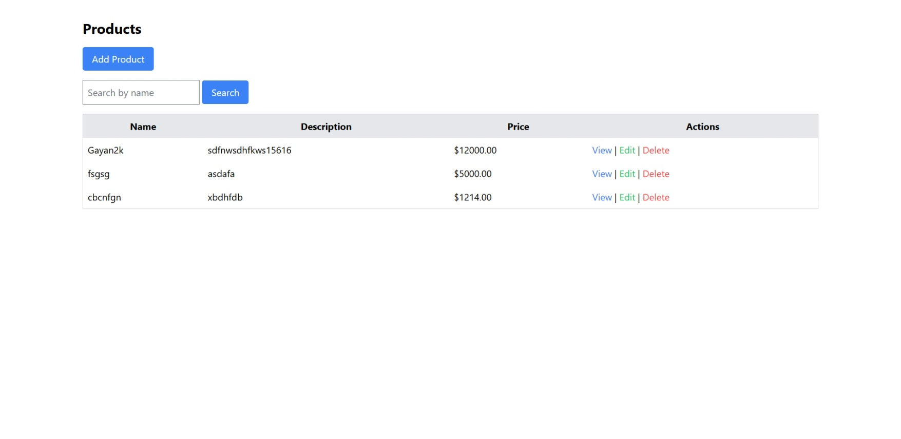
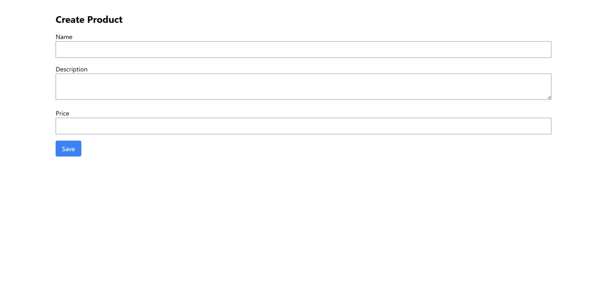
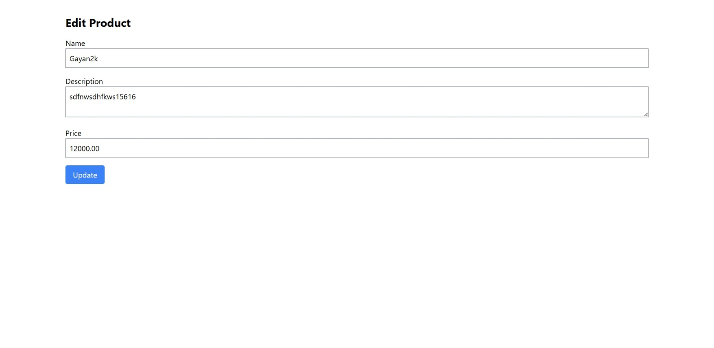

# Laravel CRUD Assessment

## Description
A simple CRUD application in Laravel for managing products. Includes create, read (paginated), update, delete, validation, and bonus search functionality. Built with Laravel 11.x and Tailwind CSS 4.1.

## Setup Instructions
1. Clone the repo: `git clone https://github.com/GayanKavinda/Laravel-CRUD-Assessment-for-Intern.git`
2. Install dependencies: `composer install` and `npm install`
3. Copy `.env.example` to `.env` and configure DB (mysql used here: `touch database/database.mysql`)
4. Run migrations: `php artisan migrate`
5. Compile assets: `npm run dev`
6. Start server: `php artisan serve`
7. Visit `http://127.0.0.1:8000/products`

## Screenshots
- Index Page: 
- Create Form: 
- Edit Form: 
- Show Page: 

## Extras
- Search functionality on index page.
- Tailwind CSS for styling.

## Ongoing Development
-Image Function
- Categories part